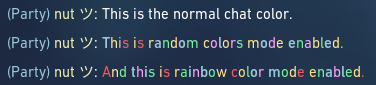

# ValoPride (PATCHED - 08/07/21)

Allows you to send colored messages in valorant.

## What does it look like?

## How to setup?
- Method 1: Download the python file of the latest commit and execute it with a minimum version of `Python 3`. The terminal window have to stay opon all time.
- Method 2: Download the latest executable file from releases inside the `.zip archive` and press `OK` after execting it. You may be warned from your antivirus, because the script simulate keyboard pressed, but its completly harmless.

## How does the code work?
1. RSHIFT Key Press Detection
2. Simulate `Ctrl+A` and `Ctrl+X` on you keyboard.
3. Read the clipboard and modify the content string to to color format. (Normaly used as tags, to render different colors)
4. Write the edited content to your clipboard.
5. Simulate `Ctrl+V` on your keyboard.

## Is it currently working correctly?
Yes and no. Since the patch on `08/07/2021` Riot Games filters all `<` charcters out of the message when sending and receiving the message on a different client. This was client-side bypassed by replacing the `<` through `&lt;` which is the representing this tag as `HTML Entity`.
> Only you can see the colors in your own messages now.
